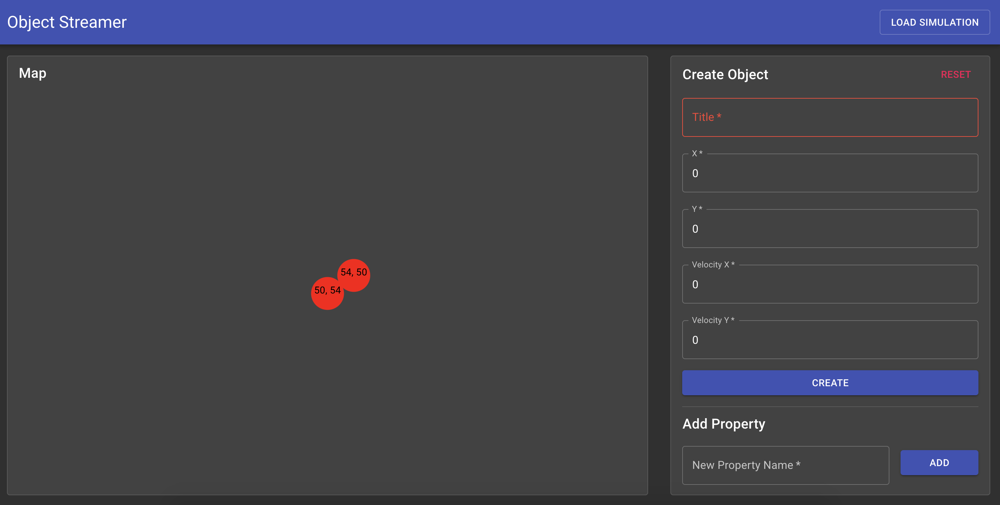

# Object Streamer

## Run

It's recommended to use Docker Compose to run the application:

1. `git clone https://github.com/paul-wentworth/object_streamer.git`
2. `cd object_streamer`
3. `docker compose up`

This method will serve a static, production version of the frontend at `http://localhost:3000` with Progressive Web App (PWA) service workers enabled.

#### Run in Development Mode

If you prefer to run in development mode there are `npm start` commands for both the frontend and backend, and a Dockerfile (and .sql initialization files) to build the PostgreSQL database container.

## User Manual

Object Streamer allows you to create and edit objects that will appear on a simple SVG "map". Objects have the following properties:

- Title
- Position (relative x,y coordinates ranging from 0% to 100%)
- Velocity
- Unlimited dynamic properties (key/value map of strings)

When moving objects exit the map they will "wrap" around to the opposite side and continue moving, this is why their positions can only effectively range from 0% to 100%.

The "Load Simulation" button in the top right corner can be used to add a couple sample objects.

The "Reset" button in top right of the create/edit form will reset the fields of the form, and switch from edit mode back to create mode.

## Architecture

- [Frontend] React with Material UI (built with [Create React App](https://create-react-app.dev/)'s PWA template)
- [Backend] Node.js with Express
- [Database] PostgreSQL

#### Simulation

For simplicity, the simulation is performed entirely within the database using calculated updates.

#### WebSockets

WebSockets will stream real-time object data (based upon the simulation) to clients at a frequency of ~2Hz.

## Todo

(In no particular order)

- Pagination
- Animate object movement
- Drag and drop objects to reposition them
- WebSocket heartbeat
- POST/PUT/DELETE multiple objects in one HTTP request
- Perform simulation in Node.js and write updates to database occasionally
- HTTPS
- React Router
- Switch from SVG to Canvas to allow more objects to be rendered at one time

## Known Bugs

- On Firefox (Ubuntu 18.04) the Material UI TextFields will not allow decimal values.
- If you make changes to the source and then re-run Docker Compose the changes may not appear for one of two reasons:
  - Docker Compose caches old builds (to fix this run `docker compose build --no-cache` first)
    - The PWA Service Workers love to cache the website, force a hard refresh with Shift+Refresh Button in Chrome on Mac OS, or Ctrl+Refresh Button on Windows.
